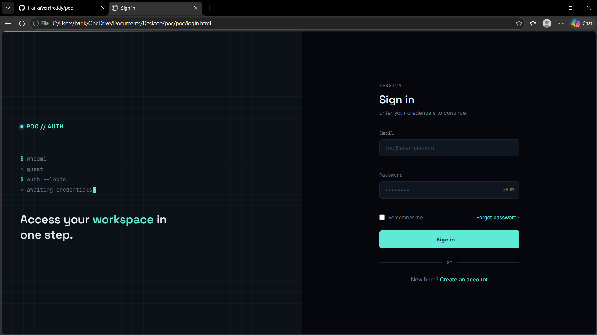
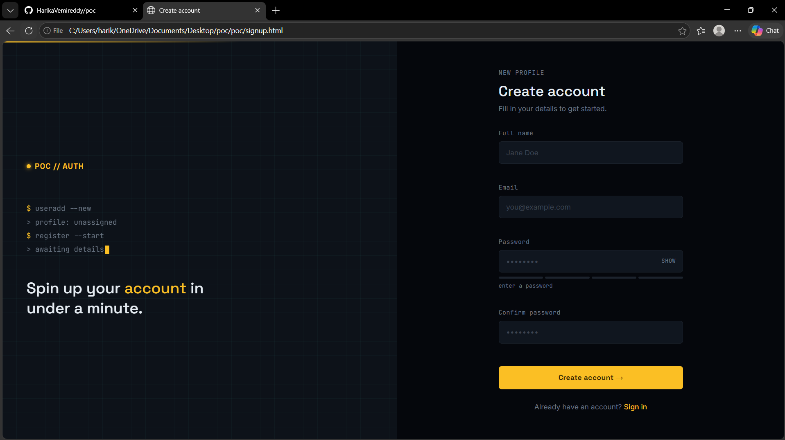
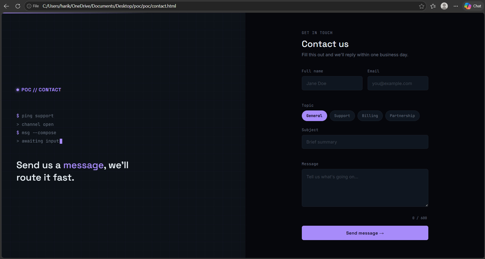
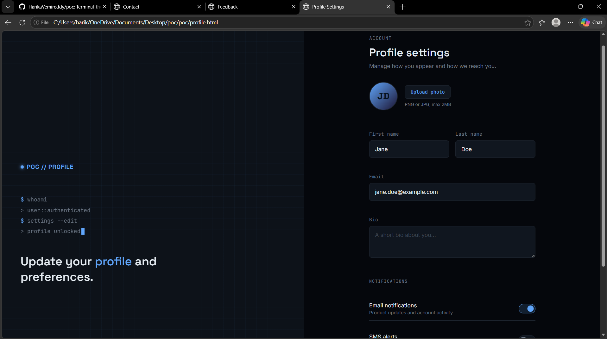
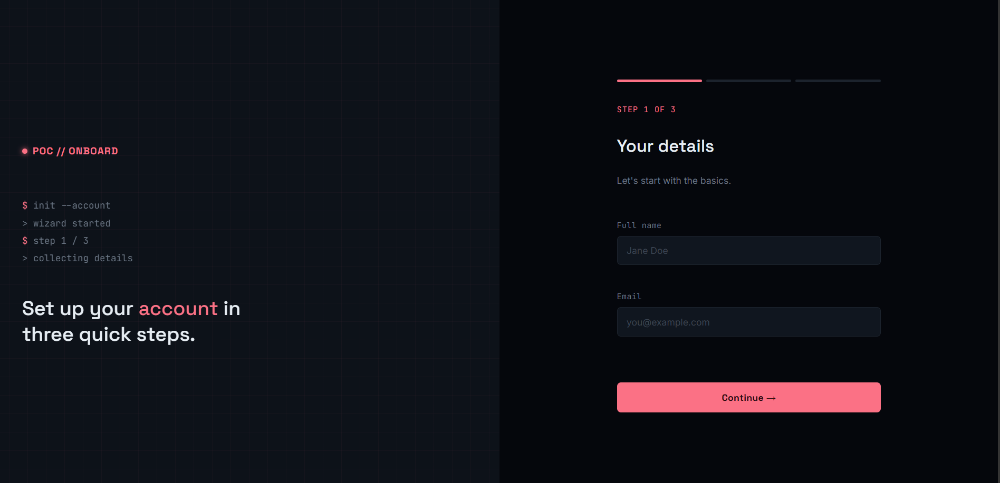
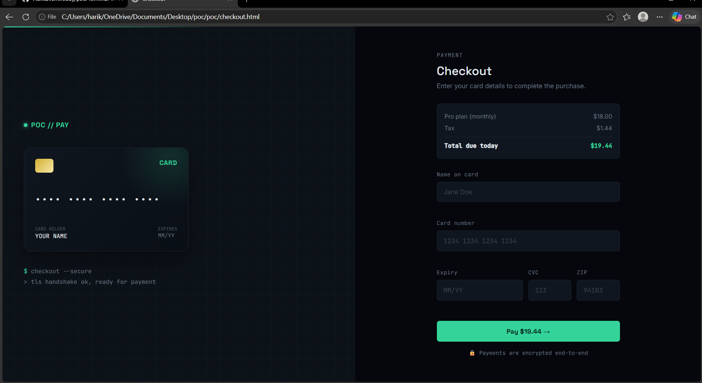
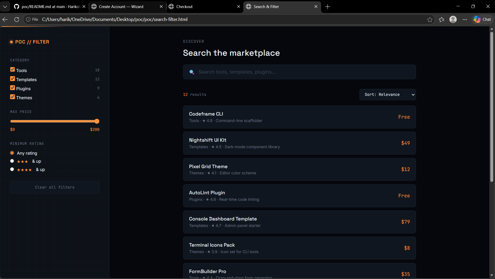
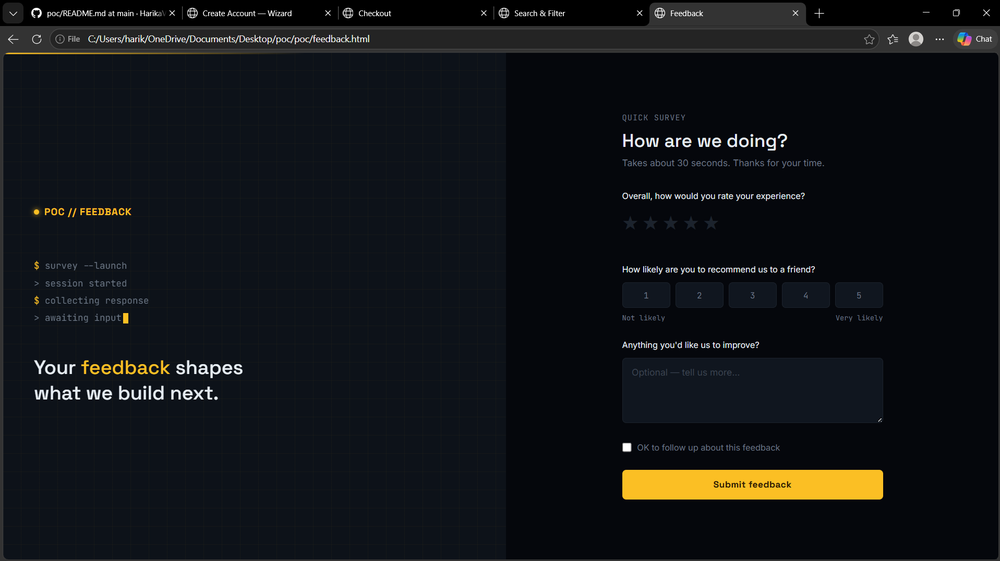

# poc

A set of terminal-themed HTML forms — proof of concept.

## Preview

Eight standalone HTML pages sharing one design system: a terminal-themed, split-screen layout with an animated boot-sequence console on one side and a live-validated form on the other. Each form has its own accent color.

## Files

- `login.html` — sign-in form (teal accent). Validates email format and password length inline; includes a show/hide password toggle.
- `signup.html` — account creation form (amber accent). Adds full name and confirm-password fields, plus a live password-strength meter.
- `contact.html` — contact form (violet accent). Topic pills, live character counter, inline validation.
- `profile.html` — profile/settings form (blue accent). Avatar upload with live preview, notification toggle switches.
- `signup-wizard.html` — multi-step signup (rose accent). 3-step flow with animated progress bar, plan selector, and review step.
- `checkout.html` — payment/checkout form (emerald accent). Live card preview that updates as you type, auto-detects card brand.
- `search-filter.html` — search & filter UI (amber/orange accent). Sidebar filters with live-updating results, no page reload.
- `feedback.html` — feedback/survey form (gold accent). Star rating, NPS scale, optional comments.

## Design

- Fonts: Space Grotesk (headings), JetBrains Mono (terminal + labels), Inter (body/inputs)
- Fully self-contained — no build step, no dependencies beyond Google Fonts
- Responsive down to mobile (stacks vertically below 820px)
- Shared design language: dark void background, grid overlay, animated console boot lines, distinct accent color per form

## Status

Front-end only. Form submissions currently show a confirmation state in the UI — not yet wired to a backend API.

## Next steps

- Connect forms to a backend (FastAPI / Django REST) for real data handling
- Add JWT-based session handling for auth forms
- Add unit/integration tests for validation logic
- Extract shared CSS variables into a single stylesheet to avoid duplication across pages
